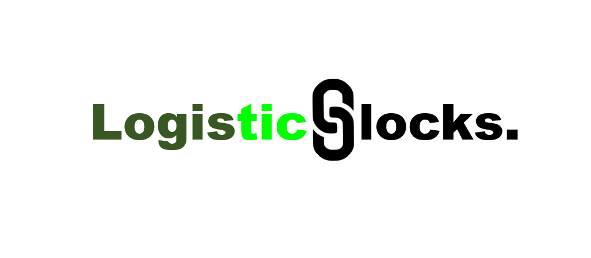

# LogisticsBlocks
----

Post world war II is an vital era to the world. Liberalism, world peace have been increasing day by day, and people start to live more than before world war II. As human growth increases rapidly, people needed increase rapidly as well. So, we need to supply human needs efficiently as well as we have to protect the environment and the quality of products.

Our mission is to use blockchain as our building blocks and other technical tools to provide environment-friendly supply chain solutions to the world to connect all logistics blocks to provide human needs most efficiently than ever. 

#### Our Slogan:  Protecting the quality of the earth is an art.   
